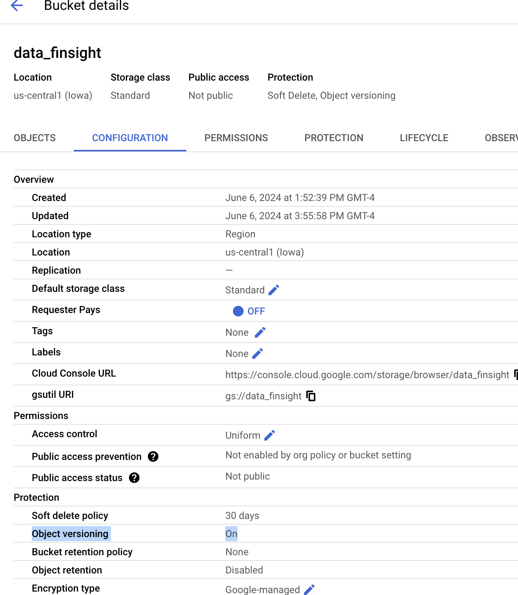

# FinSight
Adaptive Stock Prediction and Monitoring Pipeline

### Table of Contents
1. [Introduction](#introduction)
2. [Project Structure](#project-structure)
3. [Prerequisites](#prerequisites)
4. [Installation](#installation)
5. [Usage](#usage)
6. [Data Pipeline Workflow](#data-pipeline-workflow)
7. [Testing](#testing)
8. [Logging and Tracking](#logging-and-tracking)
9. [Data Version Control](#data-version-control)
10. [Pipeline Optimization](#pipeline-optimization)
11. [Schema and Statistics Generation](#schema-and-statistics-generation)
12. [Anomalies Detection and Alerts](#anomalies-detection-and-alerts)

### Introduction
This project demonstrates a comprehensive pipeline for processing stock data and making a prediction. It includes data preprocessing, testing, workflow orchestration with Apache Airflow, data versioning with DVC, schema generation, and anomaly detection. The project is documented to ensure replication on other machines.

### Project Structure
This Project will be designed to be robust in both development and production setup. We Created 2 branches

1. ```dev``` for local development version with local storage & deployment
2. ```main``` for production ready version with Google storage & deployment lined with google cloud composer environment
    - GCS: https://console.cloud.google.com/storage/browser/us-central1-composer-65578e5b-bucket/dags;tab=objects?authuser=1&project=mlops-425015&supportedpurview=project&prefix=&forceOnObjectsSortingFiltering=false
    - Cloud Composer: https://console.cloud.google.com/composer/environments/detail/us-central1/composer/monitoring?referrer=search&authuser=1&project=mlops-425015&supportedpurview=project
3. Separated DAG tasks and its associated functions in 2 files namely ```finsight_pipeline_functions.py, finsight_pipeline_taks.py```

```
.
├── DAGs
│   └── FinSight
│       ├── __init__.py
│       ├── finsight_pipeline_functions.py
│       └── finsight_pipeline_taks.py
├── LICENSE
├── README.md
├── data
├── docs
├── model
├── scoping
│   └── Finsight-scoping-doc-final.pdf
├── tests
└── visualizations
    └── raw-data-viz.png
```

### Prerequisites
- Python 3.7+
- Apache Airflow 2.5+
- Google Cloud Services
- TensorFlow, scikit-learn, DVC
    - **Note**: tensorflow-data-validation & pip in airflow doesn't sync
    - when tried to bundling it with in image pip doesn't work.
    - functions in tfdv work independently.
- Google Cloud SDK (for GCS integration)

### Installation
1. **Clone the repository:**
   ```bash
   git clone https://github.com/aditya-prayaga/FinSight.git
   cd FinSight
    ```
    **Note:** 
    1. If the user trying to install doesn't have airflow setup/docker setup done, please follow instructions in this [video](https://www.youtube.com/watch?v=exFSeGUbn4Q&t=511s&pp=ygUTcmFtaW4gYWlyZmxvdyBzZXR1cA%3D%3D)
    2. Please git check out ```dev``` branch to find additional files like ```docker-compose.yaml```, logs etc which help us in deploying the airflow and orchestrate.

2. When you are in the FinSight directory run the initial airflow set up command via running command ```docker compose up airflow-init```. With this we create a user(airflow2) and the initial Db migrations that are necessary

3. Lastly to make the web server up, please run ``` docker compose up```

### Usage

- We can access Web server by visiting site: http://0.0.0.0:8080/home 

- Here we find our ```FinSight_pipeline``` pipeline. We can run (Click Play button) from here itself or click on the pipeline and run from there too.


### Data Pipeline Workflow

This is the initial Pipeline For which later Test tasks in airflow and Github action yml file would be added to make a seamless pipeline.


The workflow consists of a series of tasks (operators) executed in a specified order to process and analyze financial data. Below is a brief explanation of the components and workflow of this DAG (Directed Acyclic Graph).
- The DAG is defined with an ID of 'FinSight_pipeline', owner information as ```Group2```, and a start date as (6,6,2024).
- The DAG does not have a schedule interval (schedule_interval=None), meaning it needs to be triggered manually.
- download_and_uploadToDVCBucket_task: Downloads data and uploads it to a DVC bucket.
visualize_raw_data_task: Visualizes the raw downloaded data.
- divide_train_eval_test_splits_task: Divides the data into training, evaluation, and test splits.
- handle_missing_values_task: Handles missing values in the splits (train, eval, test).
- handle_outliers_in_*_data_task: Handles outliers in the respective splits (training, evaluation, test).
- generate_scheme_and_stats_*_task: Generates schema and statistics for the respective splits.
- calculate_and_display_anomalies_*_task: Calculates and displays anomalies for the respective splits.
- apply_transformation_*_task: Applies transformations to the respective splits.
- visualize_*_refined_data_task: Visualizes the refined data for the respective splits.


### Testing
1. **Running Tests:** Before running tests, ensure that all dependencies are installed. You can install them using pip install pytest, pytest_mock.
To run the tests, execute the command pytest in the root directory of the project. This will discover and run all test cases in the project.

2. **Integration with Pipeline:** The tests are designed to validate the functionality of various components of the pipeline both positive and negative scenarios. When incorporating tests into the pipeline, they should be run as part of the CI/CD process, triggered automatically whenever changes are pushed to the repository. You can integrate the test suite with popular CI/CD platforms like Jenkins, Travis CI, GitLab CI/CD, or GitHub Actions.

3. **Handling Test Failures:** In the event of a test failure, the CI/CD system will detect the failure and halt the pipeline.
Depending on the CI/CD configuration, you can set up conditional triggers to perform specific actions when a test fails.
For example, if a test fails, you might want to stop the pipeline execution, notify relevant team members via email or messaging systems, or roll back changes if necessary.
Conditional triggering of tasks can be achieved by defining appropriate failure conditions in the CI/CD configuration file (e.g., .gitlab-ci.yml, jenkinsfile, etc.). These conditions can specify actions to take when tests fail, such as skipping deployment steps or initiating remediation processes.

**Note:** Few of the test cases failed but as the time project progress more will be added and integrated in the pipeline. Below is the Current Test Functionality


### Logging and Tracking
- We used l```logging``` python package to log different level of information starting from INFO which is just printing to WARN, DEBUG, ERROR, etc.
- We use Exception handling to catch any errors and logged them as errors for better visibility in both airflow local and gcp cloud composer setup.

### Data Version Control
- We handled data version controlling (DVC) by relying on the Google Cloud Storage Object Versioning for Production
-  We plan to programmatically tackle for local version controlling of data by enabling dvc init & Bash Operator in airflow.



### Pipeline Optimization
To ensure the efficiency and reliability of the pipeline, several optimization strategies can be applied:

1) Parallel Task Execution: Where possible, tasks should be executed in parallel to reduce the overall runtime of the pipeline. Airflow supports parallel task execution by defining independent tasks and setting appropriate dependencies.
2) Caching and Intermediate Storage: Use caching mechanisms and intermediate storage solutions to avoid redundant computations and data processing. This can significantly speed up the pipeline, especially when dealing with large datasets.
3) Error Handling: Implement robust error handling to ensure that transient issues do not cause the entire pipeline to fail. Configure tasks with appropriate retry policies and alerting systems.

**Note:** Future work includes refining the Git pipelines, test integrations and improving task execution efficiency.

### Schema and Statistics Generation

The generate_scheme_and_stats function is responsible for generating and validating the schema and statistics of the dataset. This process includes:

1) Schema Inference: Using TensorFlow Data Validation (TFDV) to infer the schema of the dataset, which includes data types, ranges, and distributions of features. This schema serves as a baseline for data quality checks.
2) Statistics Generation: Generating descriptive statistics from the dataset to provide insights into the distribution and characteristics of the data. These statistics are crucial for identifying anomalies and understanding data quality.
3) Schema and Statistics Visualization: Visualizing the schema and statistics to facilitate easy inspection and validation. This helps in quickly identifying any discrepancies or issues with the data.

~~~
# Schema
schema = tfdv.infer_schema(df)
tfdv.display_schema(schema)

# Stats
data_stats = tfdv.generate_statistics_from_dataframe(df)
tfdv.visualize_statistics(data_stats)

logging.info("Pushing data splits to XCom.")
ti.xcom_push(key='schema', value=schema)
ti.xcom_push(key='stats', value=data_stats)

~~~
**Note:** tfdv integration into airflow is troublesome the version of python with airflow docker image should match precisely with the tfdv 1.3.1 version.

### Anomalies Detection and Alerts

Detecting and managing anomalies in the data is critical to maintain the integrity and accuracy of the pipeline outputs. The calculate_and_display_anomalies function is designed to:

1. Anomaly Detection: Using the inferred schema and generated statistics, the function validates the data to detect any anomalies. These anomalies could be deviations from the expected data distribution, missing values, or outliers.
2. Anomaly Visualization: Displaying the detected anomalies helps in understanding the nature and extent of data issues. Visualization tools provided by TFDV are used to make this process intuitive.
3. Alerting Mechanism: Integrating an alerting system to notify the data engineering team when anomalies are detected. This ensures timely intervention and resolution of data quality issues.
```
schema = ti.xcom_pull(task_ids='generate_scheme_and_stats', key='schema')
statistics = ti.xcom_pull(task_ids='generate_scheme_and_stats', key='stats')
anomalies = tfdv.validate_statistics(statistics=statistics, schema=schema)
tfdv.display_anomalies(anomalies=anomalies)
```
